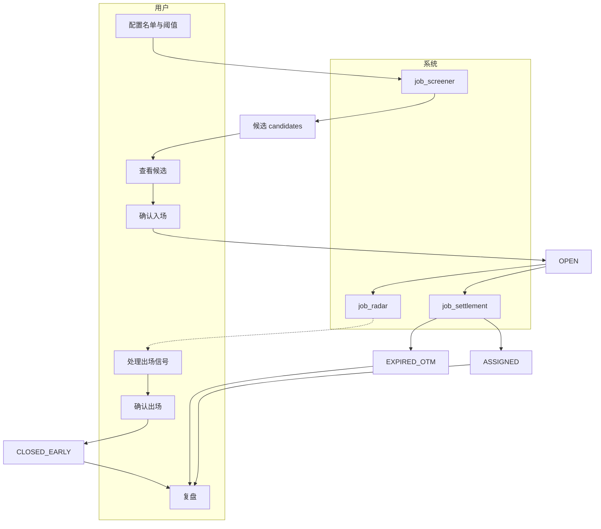
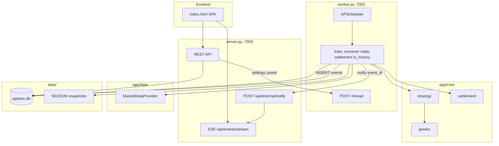
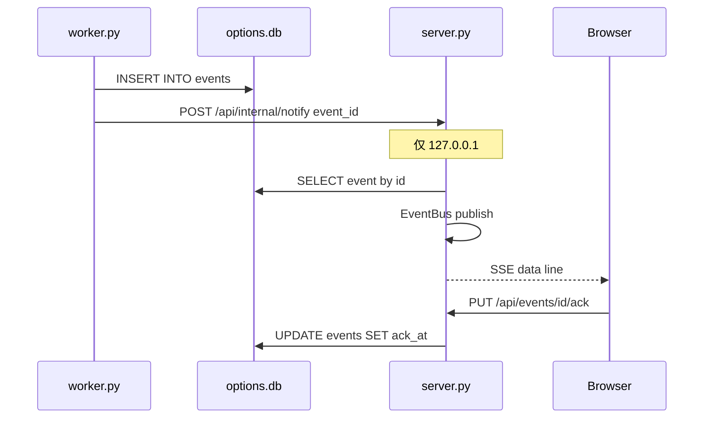

# us-option-trading-assistant — 设计规格

**日期**：2026-05-12  
**状态**：已冻结（MVP 范围）  
**项目根**：`/Users/soul/Documents/Cursor/FOSS/`（本仓库即 `us-option-trading-assistant`，独立项目）

---

## 1. 项目定位与目录骨架

### 1.1 一句话定位

面向个人期权卖方的本地工具：**标的挖掘 → 进场信号 → 持仓监控 → 出场信号 → 到期结算 → 策略复盘**，强调本地可控、免费数据源起步、**人在回路**（不自动下单）。

### 1.2 MVP 策略范围

- **MVP**：仅 **Cash-Secured Short Put（卖 Put）**。
- **后续**：研究垂直价差、Iron Condor、Wheel、跨期等组合策略；数据模型与 Provider 抽象需预留扩展点。

### 1.3 技术选型摘要

| 层级 | 选择 | 说明 |
|------|------|------|
| 语言 | Python 3.11+ | 与现有个人工具栈一致 |
| Web | Flask + 原生 JS + Tailwind + Chart.js | 对齐 `us-stock-trading-assistant` 风格，非 Streamlit |
| 行情 / 期权链 | `MarketDataProvider` 抽象 | MVP 默认 **yfinance**；Tradier / IBKR 预留实现 |
| Greeks | Provider 优先 + `core/greeks.py` Black–Scholes 兜底 | 一致性由 UI 标注「供应商 / 计算」区分 |
| 存储 | SQLite `data/options.db`（WAL） | 链快照存 NDJSON，元数据指针在库内 |
| 进程 | **分进程**：`server.py` + `worker.py` | 见第 3、6 节 |
| 通知 | 页内 Toast + 侧栏铃铛下拉 | 无 Web Push / 邮件 / Webhook（MVP） |

### 1.4 目录骨架（目标结构）

```text
FOSS/   # 即 us-option-trading-assistant 根目录
├── README.md
├── CLAUDE.md
├── ARCHITECTURE.md
├── DESIGN.md
├── TECHNICAL.md
├── .gitignore
├── run.py                 # 实施阶段：依赖检查、起 worker、起 server、开浏览器
├── server.py              # Flask + REST + SSE，端口 7000
├── worker.py              # APScheduler + Jobs，内部 HTTP 7001（/reload, /healthz）
├── requirements.txt       # 实施阶段
├── app/
│   ├── core/              # strategy, greeks, settlement（纯函数、可单测）
│   ├── data/              # provider_base, provider_yfinance, provider_tradier, provider_ibkr(stub)
│   ├── db/                # schema.sql, repo.py
│   ├── jobs/              # scheduler, job_screener, job_radar, job_settlement, job_iv_history
│   ├── api/               # Flask 蓝图
│   └── notify/            # EventBus + SSE 桥接
├── data/
│   ├── snapshots/         # screener_*.ndjson, chain_*.ndjson
│   └── options.db         # 运行时生成，不入库
├── frontend/
│   ├── index.html
│   ├── styles.css
│   └── js/
└── tests/
```

---

## 2. 业务工作流（状态机）

### 2.1 人在回路闭环

1. 用户配置观察名单与筛选阈值 → 保存到 `settings` / `watchlist`。
2. **Worker** 定时扫描期权链 → 评分过滤 → 写入 `candidates` + 快照文件 → 发事件（如新高分候选）。
3. 用户在 **#screener** 查看候选 → **确认入场** → 录入成交价与张数 → `positions` 进入 `OPEN`。
4. **Worker** 雷达定时评估持仓 → 写 `radar_snapshots` → 触发出场类事件（50% 利润、14 天、3% 距离等）。
5. 用户在 **#positions** 根据 Toast / 铃铛处理 → **确认出场** → 更新 `CLOSED_EARLY` 等。
6. 到期由 **job_settlement** 用收盘价判定 OTM / ITM（ASSIGNED）→ 更新状态。
7. **#review** 汇总胜率、年化、按出场原因切片等。

### 2.2 合约 / 持仓状态

| 状态 | 含义 |
|------|------|
| `CANDIDATE` | 仅存在于 `candidates` 表，非独立状态列；用户未确认前 |
| `OPEN` | 持仓中 |
| `CLOSED_EARLY` | 提前平仓买回 |
| `EXPIRED_OTM` | 到期虚值，全额权利金 |
| `ASSIGNED` | 实值被行权（与股票持仓联动 **占位**，MVP 不导出到其他项目） |

`positions.state` 使用上述字符串（`CANDIDATE` 不落 `positions`，仅候选表）。

### 2.3 状态流转（Mermaid）



---

## 3. 模块依赖与运行时架构（分进程）

### 3.1 进程与端口

| 进程 | 职责 | 监听 |
|------|------|------|
| `server.py` | Flask REST、静态前端、`GET /api/events/stream`（SSE）、`POST /api/internal/notify`（127.0.0.1 白名单） | **7000** |
| `worker.py` | APScheduler：screener / radar / settlement / iv_history；`POST /reload`、`GET /healthz` | **127.0.0.1:7001** |

### 3.2 依赖关系（Mermaid）



### 3.3 分层原则

- **`app/core`**：不依赖 Flask、不依赖具体 Provider；入参为领域 dataclass（如 `OptionContract` 列表）。
- **`app/data`**：实现 `MarketDataProvider`；可调用 yfinance / HTTP；负责裁剪链、重试、缓存元数据。
- **`app/jobs`**：编排 I/O、调用 core、写 DB、触发通知。

---

## 4. 数据模型与 SQLite 表结构

### 4.1 全局约定

- 时间：UTC ISO8601 文本存 SQLite；展示由前端按本地时区。
- 金额：`REAL`；百分比保留 4 位小数。
- SQLite：`PRAGMA journal_mode=WAL;`（实施阶段初始化时执行）。

### 4.2 佣金（MVP）

- 前期 **固定每张合约**佣金（例如 USD 1），存于 `settings` JSON（如 `fees.usd_per_contract`）；复盘 P&L 统一扣除。

### 4.3 DDL（7 张表）

```sql
-- 1. 配置 KV
CREATE TABLE settings (
  key   TEXT PRIMARY KEY,
  value TEXT NOT NULL
);

-- 2. 观察名单（解析自用户输入，支持中英文逗号）
CREATE TABLE watchlist (
  symbol      TEXT PRIMARY KEY,
  added_at    TEXT NOT NULL,
  earnings_at TEXT,
  enabled     INTEGER NOT NULL DEFAULT 1
);

-- 3. 扫描批次
CREATE TABLE scan_runs (
  id              INTEGER PRIMARY KEY AUTOINCREMENT,
  started_at      TEXT NOT NULL,
  finished_at     TEXT,
  provider        TEXT NOT NULL,
  symbol_count    INTEGER,
  candidate_count INTEGER,
  snapshot_path   TEXT,
  trigger           TEXT NOT NULL
);

-- 4. 候选合约（Short Put 快照）
CREATE TABLE candidates (
  id              INTEGER PRIMARY KEY AUTOINCREMENT,
  scan_run_id     INTEGER NOT NULL REFERENCES scan_runs(id) ON DELETE CASCADE,
  symbol          TEXT NOT NULL,
  expiration      TEXT NOT NULL,
  strike          REAL NOT NULL,
  bid             REAL, ask REAL, mid REAL,
  spot            REAL,
  iv              REAL,
  iv_rank         REAL,
  delta           REAL, theta REAL, vega REAL, gamma REAL,
  dte             INTEGER,
  annualized_roi  REAL,
  pop             REAL,
  spread_pct      REAL,
  breakeven       REAL,
  margin_buffer   REAL,
  score           REAL,
  open_interest   INTEGER
);
CREATE INDEX idx_candidates_score ON candidates(scan_run_id, score DESC);

-- 5. 持仓
CREATE TABLE positions (
  id                INTEGER PRIMARY KEY AUTOINCREMENT,
  symbol            TEXT NOT NULL,
  expiration        TEXT NOT NULL,
  strike            REAL NOT NULL,
  contracts         INTEGER NOT NULL,
  open_at           TEXT NOT NULL,
  open_premium      REAL NOT NULL,
  open_candidate_id INTEGER REFERENCES candidates(id),
  state             TEXT NOT NULL,
  close_at          TEXT,
  close_premium     REAL,
  close_reason      TEXT,
  realized_pnl      REAL,
  notes             TEXT
);
CREATE INDEX idx_positions_state ON positions(state);

-- 6. 雷达快照
CREATE TABLE radar_snapshots (
  id            INTEGER PRIMARY KEY AUTOINCREMENT,
  position_id   INTEGER NOT NULL REFERENCES positions(id) ON DELETE CASCADE,
  taken_at      TEXT NOT NULL,
  spot          REAL,
  current_mid   REAL,
  pnl_pct       REAL,
  delta         REAL,
  margin_buffer REAL,
  signals       TEXT
);
CREATE INDEX idx_radar_position ON radar_snapshots(position_id, taken_at);

-- 7. 事件中心
CREATE TABLE events (
  id         INTEGER PRIMARY KEY AUTOINCREMENT,
  created_at TEXT NOT NULL,
  level      TEXT NOT NULL,
  category   TEXT NOT NULL,
  title      TEXT NOT NULL,
  payload    TEXT,
  ack_at     TEXT,
  acted_at   TEXT
);
CREATE INDEX idx_events_created ON events(created_at DESC);
```

### 4.4 `close_reason` 与复盘切片

平仓 / 结算时 `positions.close_reason` 取值（与雷达信号及复盘一致）：

`take_profit_50` | `take_profit_75` | `time_14d` | `time_7d` | `danger_3pct` | `delta_breach` | `manual` | `expired_otm` | `assigned`

系统自动结算写入 `expired_otm` / `assigned`；用户手动平仓可写 `manual` 或选择与最近信号对齐的原因。

---

## 5. MarketDataProvider 抽象与 MVP 数据源

### 5.1 接口契约（概念）

- `name: str`，`realtime: bool`（影响 UI 徽章与默认调度间隔建议）。
- `get_quote(symbol) -> Quote`：spot、`asof`、可选 `iv_rank`（可由策略层用 RV 代理计算后回填）。
- `get_expirations(symbol) -> list[date]`。
- `get_option_chain(symbol, expiration, right="P") -> list[OptionContract]`。
- `get_historical_close(symbol, day) -> float | None`（周末 / 节假日回退上一交易日）。
- `get_iv_history(symbol, days=252)`：用于 **IV Rank 的 RV 代理**（见 7.1）。
- `get_next_earnings(symbol) -> date | None`：MVP 使用 **yfinance `Ticker.calendar`**；拿不到返回 `None`，UI 不显示该标的财报徽标。

### 5.2 默认实现：`provider_yfinance`

- 速率限制：`requests-cache` + 指数退避（最多 3 次）；失败率超阈值写 `system.provider_throttled` 类事件。
- 大链裁剪：按 DTE 与 strike 距 spot 比例过滤后再返回上层。
- Greeks：字段缺失时由 `core/greeks.py` 填充；无风险利率来自 `settings`（默认如 4.5%）。

### 5.3 预留

- `provider_tradier.py`：Sandbox / 生产由 `.env` 配置；实施阶段再接线。
- `provider_ibkr.py`：空 stub + 文档说明接入路径。

### 5.4 IV Rank（MVP）

- 使用 **252 交易日已实现波动率（RV）代理** IV Rank；UI 须标注「代理指标」。
- 公式与归一化区间见第 7.1 节 `iv_rank_min` 过滤逻辑。

### 5.5 缓存建议

| 调用 | 建议 TTL |
|------|-----------|
| `get_option_chain` | 5 分钟 |
| `get_iv_history` / RV | 24 小时 |
| `get_historical_close` | 永久本地缓存（历史不变） |

---

## 6. 后台调度与通知通道

### 6.1 Jobs 与默认节奏

| Job | 默认间隔 | 交易时段 |
|-----|-----------|-----------|
| `job_screener` | **15 分钟** | 美东交易日 09:30–16:00 |
| `job_radar` | **15 分钟** | 同上 |
| `job_settlement` | 每日 16:30 ET | 一次 |
| `job_iv_history` | 每日 17:00 ET | 刷新 RV 相关缓存 |

具体 Cron 表达式与 `misfire_grace_time`（如 300s）在实施阶段配置；**所有间隔可经 `settings` 调整**。

### 6.2 Settings 热加载（实时）

1. 用户在前端 **#settings** 保存 → `POST /api/settings` → server 写 `settings` 表。
2. Server 立即 `POST http://127.0.0.1:7001/reload`。
3. Worker 重读 `settings` 并 **重新注册 / 更新** APScheduler 任务间隔。

### 6.3 跨进程通知（Mermaid 时序）



- Worker 调 notify 失败：事件仍在 DB；用户打开页面后可 REST 拉未读；Server 重启后可按游标补推 SSE（实施细节见 TECHNICAL.md）。

### 6.4 APScheduler JobStore

- 使用 **SQLAlchemyJobStore** 指向同一 `options.db`（或独立 `jobs.sqlite`），以便 worker 重启后任务不丢；**依赖在实施阶段加入** `sqlalchemy`（本 spec 仅约定行为）。

---

## 7. 策略评估器与信号定义

### 7.1 入场硬过滤（默认值，全部进 `settings` JSON）

| 键 | 默认 | 含义 |
|----|------|------|
| `delta_min` / `delta_max` | 0.10 / 0.20 | \|Δ\| 区间 |
| `dte_min` / `dte_max` | 30 / 45 | 天 |
| `annualized_roi_min` | 0.20 | 年化 ROI ≥ 20% |
| `spread_pct_max` | 0.10 | (ask−bid)/mid |
| `iv_rank_min` | 50 | 基于 RV 代理的 0–100 标尺 |
| `margin_buffer_min` | 0.10 | (spot−strike)/spot |
| `min_open_interest` | 50 | 流动性 |
| `exclude_earnings_within_days` | 7 | 财报日前淘汰 |

**派生指标**（写入 `candidates`）：

- `mid = (bid+ask)/2`（缺一边则跳过或降级策略在实施阶段定义）。
- `breakeven = strike - mid`。
- `annualized_roi = (mid / strike) * (365 / dte)`（保证金近似为 strike）。
- `margin_buffer = (spot - strike) / spot`。
- `pop ≈ 1 - abs(delta)`（简化近似，UI 可说明）。
- `spread_pct = (ask - bid) / mid`。

**IV Rank（RV 代理）**：用过去 252 日对数收益标准差年化得 RV；将当前 ATM IV（或合约 IV）与 RV 分位数映射到 0–100（实施阶段给出精确公式与边界处理）。

### 7.2 综合评分（加权线性）

权重存 `settings.scoring_weights`，默认：

- `annualized_roi` 0.35  
- `iv_rank` 0.25  
- `spread_pct` 0.15（价差越小越好，取反归一）  
- `margin_buffer` 0.15  
- `open_interest` 0.10  

每项 `normalize(x, lo, hi)` 截断到 \[0,1\]，再线性组合为 `score`；结果表按 `score DESC`，默认展示 Top 20。

### 7.3 出场信号（雷达）

对 `OPEN` 持仓每轮计算，写入 `radar_snapshots.signals`（JSON 数组）并去重后发 `events`：

| 信号 ID | 条件 | level |
|---------|------|-------|
| `take_profit_50` | `pnl_pct >= 0.50` | warn |
| `take_profit_75` | `pnl_pct >= 0.75` | warn |
| `time_14d` | `dte <= 14` | warn |
| `time_7d` | `dte <= 7` | danger |
| `danger_3pct` | `(spot - strike) / strike <= 0.03` | danger |
| `delta_breach` | `abs(current_delta) >= 0.40` | danger |

**幂等**：同一 `position_id + signal_type` 在未 ACK 且未恶化重置前不重复插入事件；细则在实施阶段写清。

### 7.4 `settings` JSON 顶层结构

```json
{
  "filters": {
    "delta_min": 0.1,
    "delta_max": 0.2,
    "dte_min": 30,
    "dte_max": 45,
    "annualized_roi_min": 0.2,
    "spread_pct_max": 0.1,
    "iv_rank_min": 50,
    "margin_buffer_min": 0.1,
    "min_open_interest": 50,
    "exclude_earnings_within_days": 7
  },
  "exits": {
    "take_profit_pct": 0.5,
    "take_profit_strong_pct": 0.75,
    "time_warning_dte": 14,
    "time_danger_dte": 7,
    "danger_distance_pct": 0.03,
    "delta_breach_abs": 0.4
  },
  "scoring_weights": {
    "annualized_roi": 0.35,
    "iv_rank": 0.25,
    "spread_pct": 0.15,
    "margin_buffer": 0.15,
    "open_interest": 0.1
  },
  "schedule": {
    "screener_minutes": 15,
    "radar_minutes": 15,
    "settlement_time_et": "16:30",
    "iv_refresh_time_et": "17:00"
  },
  "provider": "yfinance",
  "fees": { "usd_per_contract": 1.0 },
  "risk_free_rate": 0.045
}
```

字段名与第 7.1–7.3 节及 UI 分组一一对应；实施阶段不得引入未文档化键而不更新本 spec。

---

## 8. UI 信息架构

### 8.1 路由（hash SPA）

| 路由 | 页面 |
|------|------|
| `#screener` | 候选筛选（主战场） |
| `#positions` | 持仓雷达 |
| `#review` | 复盘 |
| `#settings` | 系统设置 |

**无独立事件中心页**：侧栏顶部 **铃铛 + 下拉**（最近 20 条、全部已读、点击跳转关联持仓/候选）。

### 8.2 全局

- 顶栏：项目名称、`Provider` 名、延迟/实时徽章、**SSE 连接状态点**。
- Toast：堆叠上限 5；`danger` 级不自动消失。
- 数据源为 yfinance 时明确标注「非专业实时、约延迟 15 分钟」类文案。

### 8.3 #screener

- 观察名单 textarea（中英文逗号兼容）；财报 7 日内 **黄色 badge**（数据来自 calendar 时）。
- 条件概览 + 「立即扫描」`POST /api/scan/run`。
- 表格列：`Symbol | Exp | Strike | Mid | Δ | DTE | IV | IV Rank | 年化 ROI | POP | Spread% | 安全垫 | Score | 入场`。
- 行 hover：Short Put 盈亏示意图（Chart.js）。
- 入场模态：确认 strike/expiry，录入成交 mid 与张数 → `POST /api/positions`。

### 8.4 #positions

- 卡片网格：P&L、`pnl_pct` 条、信号徽章、24h 小图、平仓 / 备注。
- `ASSIGNED` 占位提示：后续股票工作流待定。

### 8.5 #review

- **总览四指标**：总胜率、平均年化、累计权利金、总交易笔数（均已扣固定佣金）。
- **按 `close_reason` 切片表**。
- 明细表 + CSV 导出。
- **预留**（灰显 Tab，v1.x）：按标的、IV Rank 分档、DTE 分档、Delta 分档。

### 8.6 #settings

- 分组：`filters` / `exits` / `scoring_weights` / `schedule` / `provider` / `fees`。
- 保存 → 写 DB → **立即** `POST worker:7001/reload`。

---

## 9. 部署、配置、测试与 MVP 不做清单

### 9.1 启动

- `python3 run.py`：检查 Python ≥3.11、`pip3 install -r requirements.txt`（首次）、DB 初始化、后台启动 `worker.py`、前台 `server.py`、打开 `http://127.0.0.1:7000`。
- macOS 可提供 `启动期权助手.command`（实施阶段）。
- Ctrl+C：`run.py` 负责终止 worker（`data/worker.pid`）。

### 9.2 密钥

- `.env`：`TRADIER_API_KEY` 等；**不入库**；`.env.example` 提交仓库。

### 9.3 测试金字塔

- **单元**：`strategy` / `greeks` / `settlement`，固定输入输出。
- **集成**：Fake Provider + 内存或文件 SQLite，`jobs` 全链路。
- **API**：Flask `test_client` + mock worker notify。
- **不做**：Playwright / Selenium UI E2E（MVP）。

### 9.4 MVP 明确不做（YAGNI）

- 自动下单、券商 API 交易指令。
- 组合策略（垂直、Iron Condor、Wheel 等）实算与 UI。
- 被行权后与 `us-stock-trading-assistant` 的自动同步（仅占位文案 / 未来 API）。
- 按月份复盘切片。
- 多用户 / 云端部署。
- IBKR Provider 实现（仅占位）。
- Web Push、邮件、Telegram、企业微信等外部通知。
- **完整期权链历史回测**（与「成交复盘」区分：历史链数据免费源不可得）。
- 阈值修改历史表。
- Greeks 供应商 vs BS 的自动偏差告警（仅日志 warn 即可）。

### 9.5 风险与缓解

| 风险 | 缓解 |
|------|------|
| yfinance 限流 / 不稳定 | 退避、缓存、throttle 事件 |
| RV 代理 IV Rank 偏差 | UI 标注；可关闭 `iv_rank_min` 过滤 |
| 双进程 SQLite 锁 | WAL；写集中在短事务 |
| 阈值保存导致事件风暴 | 保存后 5 分钟同类信号去重窗口（实施阶段） |

---

## 文档维护

- 实施阶段若变更端口、表结构或 `settings` 契约，须同步更新本文件与 ARCHITECTURE / TECHNICAL。

**本规格经自检：无 TBD/TODO 占位；`close_reason` 与雷达信号及复盘一致；MVP 边界与第 9.4 节对齐。**
